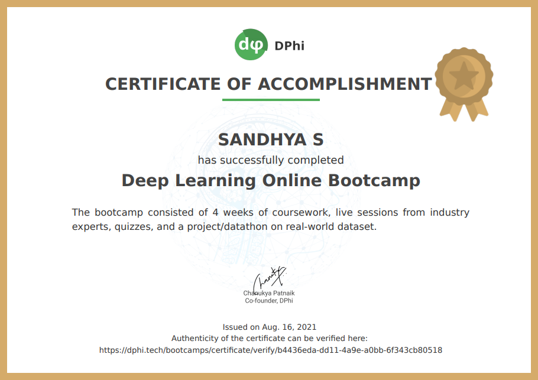

### _4 Week Online Deep Learning Bootcamp: July '21_
|_Module_|_Description_|
|:---:|:---|
|_1_| _Introduction to Deep Learning, Neural Network_ | 
|_2_| _Neural Network for Regression and Multi-layer Perceptron_ |
|_3_| _Neural Networks for Classification Problems_ |
|_4_| _Optimizing a Neural Network_ |
|_5_| _Digital Image Processing_ |
|_6_| _Convolutional Neural Networks (CNN)_ | 
|_7_| _Generative Adversarial Network (GAN)_ |
|---| ---------------------------------------------------------------------- |
|| **_• [Quiz 1: Tensor Operations](Quiz%20%26%20Assignment/%231_Graded_Quiz_1.ipynb) • [Quiz 2: Linear Regression and Hyperparameter Tuning](Quiz%20%26%20Assignment/%232_Graded_Quiz_2.ipynb) • [Assignment: Gender Determination by Morphometry of Eyes](Quiz%20%26%20Assignment/%233_Final_Assignment.ipynb)_** |
---

---
