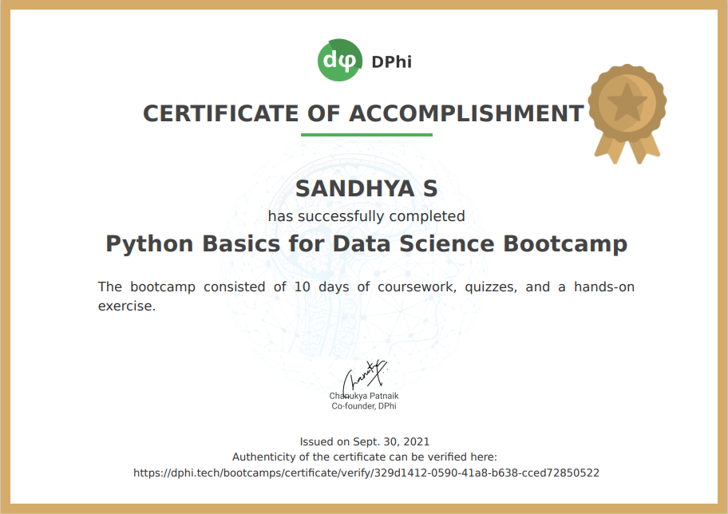
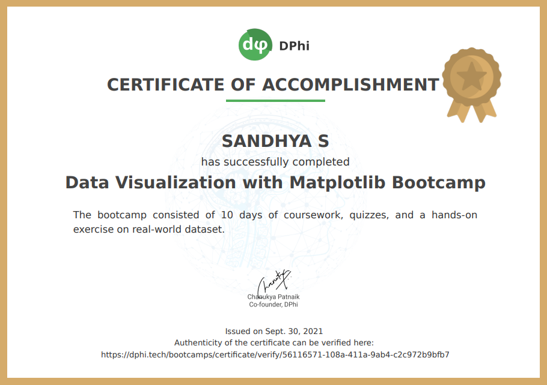

## _Data Science Mini Bootcamp Series by DPhi_
||_Title_|
|:--:|:--|
|_**1**_|_**[Introduction to Python Basics for Data Science](FILES/%231%20Python%20Basics)**_|
|_**2**_|_**[Introduction to Pandas](FILES/%232%20Pandas)**_|
|_**3**_|_**[Introduction to Data Visualization with Matplotlib](FILES/%233%20Data%20Visualization)**_|
|_**4**_|_**[Getting Started with Natural Language Processing](FILES/%234%20Natural%20Language%20Processing)**_|
---
| _Python_ | _Pandas_ | _Matplotlib_ |
| :------: | :------: | :----------: |
||||
---
